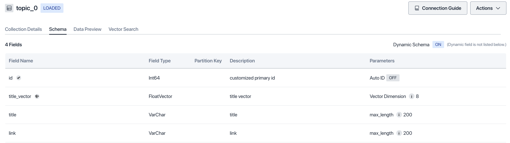
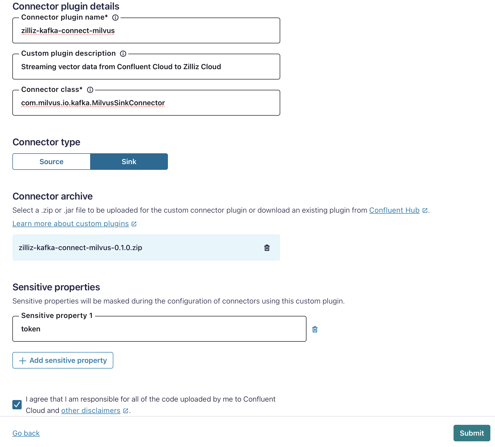
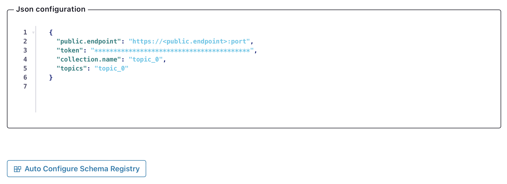
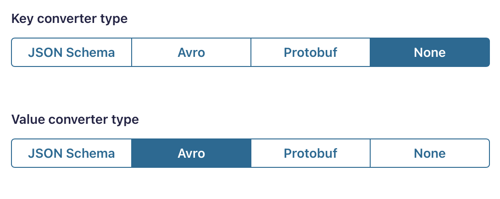
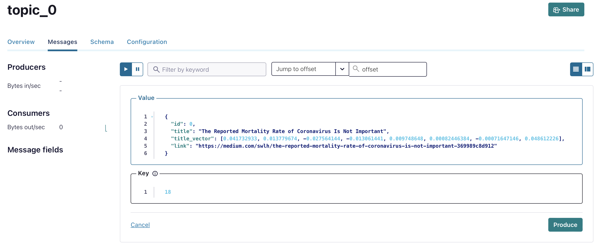
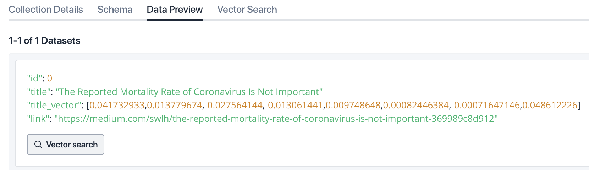

# Kafka Connect Milvus Connector

This is a Kafka sink connector for Milvus. It allows you to stream vector data from Kafka to Milvus.

This current version supports connection from
[Confluent Cloud](https://www.confluent.io/confluent-cloud/) (hosted Kafka) to Milvus (self-hosted or 
[Zilliz Cloud](https://zilliz.com/cloud)).

Zilliz Cloud and Milvus are vector databases where you can ingest, store and search vector data.
An entity in Zilliz Cloud or Milvus contains one vector field and multiple scalar fields such
as string, integer and float. To stream data, the Kafka message schema must match the schema of
the Milvus collection, containing one and only one vector field, and zero to many scalar fields.
The name of each field must be exactly the same on both sides.

# Quick Start

In this quick start guide we show how to setup Confluent Cloud and Zilliz Cloud to ingest vector data.
For self-hosted Milvus the setup is similar.

- If you want to use this connector with open source Kafka, see [README_OSS.md](README_OSS.md)

## Step 1: Download the kafka-connect-milvus plugin

Complete the following steps to download the kafka-connect-milvus plugin.

1. download the latest plugin zip file `zilliz-kafka-connect-milvus-xxx.zip` from [here](https://github.com/zilliztech/kafka-connect-milvus/releases/tag/v0.1.0).

## Step 2: Configure Confluent Cloud and Zilliz Cloud

Ensure you have Confluent Cloud and Zilliz Cloud setup and properly configured.
1. If you don't already have a topic in Confluent Cloud, create a topic (e.g. `topic_0`) in Confluent Cloud.
2. If you don't already have a collection in Zilliz Cloud, create a collection with a vector field (in this example the vector has `dimension=8`). You can use the following example schema on Zilliz Cloud:



Note: Make sure the schema on both sides match each other. In the schema, there is exactly one vector field. The names of each field on both sides are exactly the same.

## Step 3: Load the kafka-connect-milvus plugin to a Confluent Cloud instance
1. Go to the Connectors section in your Confluent Cloud cluster.
2. Click on `Add Plugin`.
3. Upload the `zilliz-kafka-connect-milvus-xxx.zip` file you downloaded in Step 1.



- Fill in Connector plugin details
- Set `com.milvus.io.kafka.MilvusSinkConnector` as Connector class.
- For Sensitive properties, fill in the config field you want to hide, such as `token` field. Please see [custom-connector](https://docs.confluent.io/cloud/current/connectors/bring-your-connector/custom-connector-qs.html) for more details.


## Step 4: Configure the kafka-connect-milvus Connector

1. Go to the `Connectors` section in your Confluent Cloud cluster.
2. Click on `Get Started`.
3. Enter Confluent Cloud API Key and Secret
4. Add Configuration for the connector

    Provide the Milvus connector config as follows:

    ```json
   {
      "public.endpoint": "https://<public.endpoint>:port",
      "token": "*****************************************",
      "collection.name": "topic_0",
      "topics": "topic_0"
   }
    ```

   - The token field is either the API token or `<username>:<password>`, depending on the instance type of your collection in Milvus or Zilliz Cloud.

5. Enter Connection endpoints, which is the public endpoint of your Milvus or Zilliz Cloud instance. Like: `in01-034b8444ab99cab.aws-us-west-2.vectordb.zillizcloud.com`

6. Choose size, the number of tasks to be run

7. Review and launch

#### Sample Config




#### Kafka Topic Converter
We support Json, JsonSchema, Avro, ProtoBuf format for Kafka topic,
if your topic has an output format other than plain json, you need to choose the converter type in `Auto Configure Schema Registry`.




- Sample Config for kafka topic with schema, check [here](https://docs.confluent.io/platform/current/schema-registry/connect.html) for more details
  

  
## Step 5: Launch the connector

Start the connector to begin streaming data from Kafka to Milvus.

1. Try produce a message to the Kafka topic you just created in Confluent Cloud
```json
{
  "id": 0,
  "title": "The Reported Mortality Rate of Coronavirus Is Not Important",
  "title_vector": [0.041732933, 0.013779674, -0.027564144, -0.013061441, 0.009748648, 0.00082446384, -0.00071647146, 0.048612226],
  "link": "https://medium.com/swlh/the-reported-mortality-rate-of-coronavirus-is-not-important-369989c8d912"
}
```
- Topic Page on Confluent Cloud



2. Check if the entity has been inserted into the collection in Zilliz Cloud. Here is what it looks like on Zilliz Cloud if the insertion succeeds:




### Support

If you require any assistance or have questions regarding the Kafka Connect Milvus Connector, please feel free to reach out to our support team: **Email:** [support@zilliz.com](mailto:support@zilliz.com)

### Disclaimer

Regarding Kafka hosting, currently this connector only supports Confluent Cloud. If used for the other forms of Kafka hosting, including but not limited to Confluent Platform and self-hosted Kafka instances, the security and usability of this connector has not been fully verified. Please use at your discretion or contact us if you intend to use it in such settings.

Regarding Milvus, both the self-hosted Milvus and Zilliz Cloud are supported.

