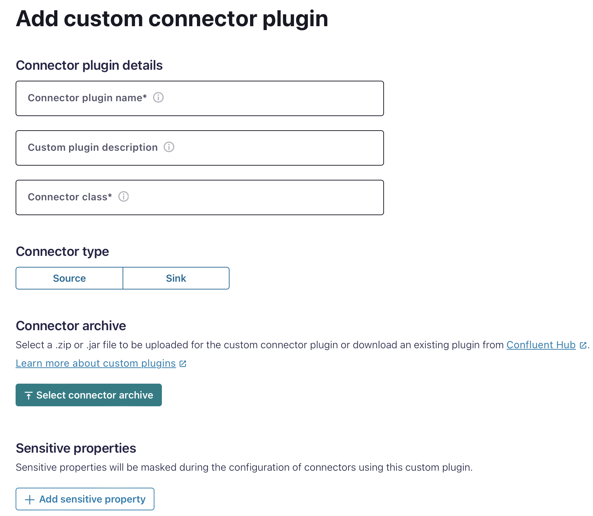

# Kafka Connect Milvus Connector

This is a Kafka sink connector for Milvus. It allows you to stream data from Kafka to Milvus.
# Quick Start

Use this quick start to get up and running with the kafka-connect-milvus connector.

## Step 1: Download the kafka-connect-milvus plugin

Complete the following steps to download the kafka-connect-milvus plugin.

1. download the plugin zip file from [here]()

## Step 2: Configure Confluent Cloud and Zilliz Cloud

Ensure you have Confluent Cloud and Zilliz Cloud setup and properly configured.
1. create a topic `topic_0` in confluent cloud.
2. create a collection `topic_0` in zilliz cloud with a vector field(dimension:8).

- make sure they have the same field name, as only the field defined in milvus collection can be inserted


## Step 3: Load the kafka-connect-milvus plugin to Confluent Cloud Instance
1. Go to the Connectors section in your Confluent Cloud cluster.
2. Click on `Add Plugin`.
3. Upload the `zilliz-kafka-connect-milvus-*.zip` file you downloaded in Step 1.



4. put `com.milvus.io.kafka.MilvusSinkConnector` into Connector class.

## Step 4: Configure the kafka-connect-milvus Connector

1. Go to the Connectors section in your Confluent Cloud cluster.
2. Click on `Get Started`.

Provide the necessary configurations, such as:

```json
{
  "public.endpoint": "https://<public.endpoint>:port",
  "token": "*****************************************",
  "collection.name": "topic_0",
  "topics": "topic_0"
}
```
- the token is the api token or username:password, depends on the authentication method you choose in zilliz cloud.
## Step 5: Launch the connector

Start the connector to begin streaming data from Kafka to Milvus.

- try produce some messages to the topic you created in confluent cloud, and check if the data is inserted into the collection in zilliz cloud.

```json
{
  "id": 0,
  "title": "The Reported Mortality Rate of Coronavirus Is Not Important",
  "title_vector": [0.041732933, 0.013779674, -0.027564144, -0.013061441, 0.009748648, 0.00082446384, -0.00071647146, 0.048612226],
  "link": "https://medium.com/swlh/the-reported-mortality-rate-of-coronavirus-is-not-important-369989c8d912"
}
```

- insearted entity in zilliz cloud


 

### Support

If you require any assistance or have questions regarding the Kafka Connect Milvus Connector, you can reach out to our support team. We are here to help you with any issues or inquiries you may have.

- **Email:** [support@zilliz.com](mailto:support@zilliz.com)